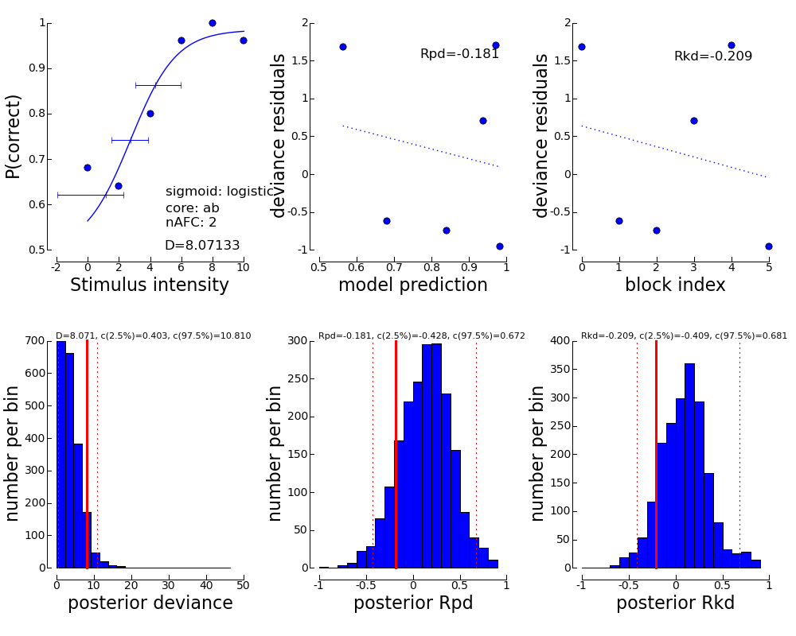
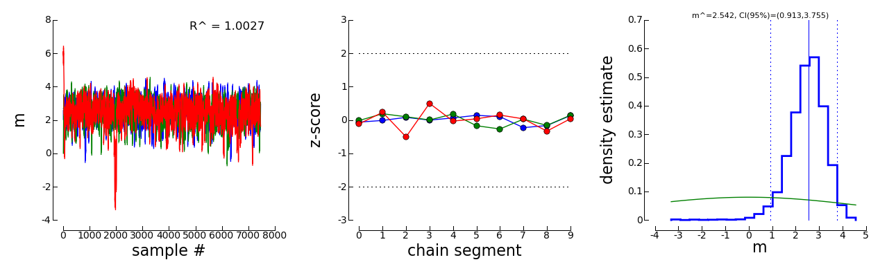
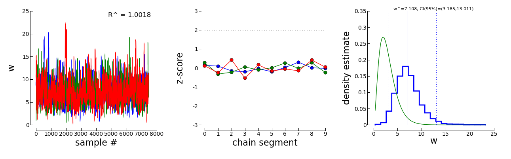
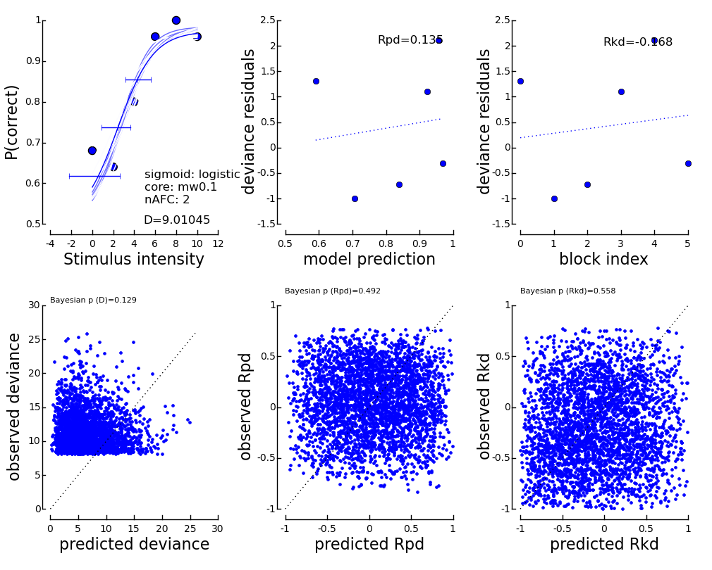
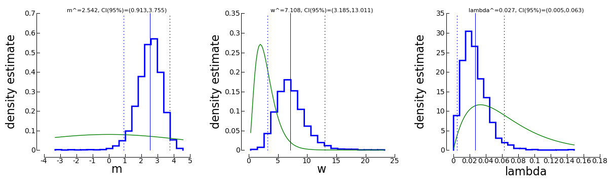

============================
A quick start to pypsignifit
============================

This document presents two example analyzes of psychometric function data using pypsignifit.
The first example explains how to fit a psychometric function using constrained maximum
likelihood as described in the papers by Wichmann and Hill (2001a,b). The second example
deals with a bayesian approach to fitting a psychometric function. Parts of the ideas for
this can be found in the paper by Kuss et al (2005), however most of this example is new
at the time of this writing.

To get you starting with pypsignifit, open a python interpreter and type the following:

>>> from pypsignifit import *
>>> dir()
['BayesInference', 'BootstrapInference', 'ConvergenceMCMC', 'GInitiallyUnowned', 'GoodnessOfFit', 'ParameterPlot', 'ThresholdPlot', '__builtins__', '__doc__', '__name__', 'show']

As you see, there is a number of functions and data types imported in the current workspace.
To view documentation about one of these functions, you can use the online python help by typing
help ( function name ). For instance,

>>> help ( BayesInference )

will show the documentation of the BayesInference object class.

We will now create an example data set for which we want to estimate a psychometric function.
We assume that the data are from a 2AFC task

>>> nafc = 2
>>> stimulus_intensities = [0.0,2.0,4.0,6.0,8.0,10.0]
>>> number_of_correct = [34,32,40,48,50,48]
>>> number_of_trials  = [50]*len(stimulus_intensities)
>>> data = zip(stimulus_intensities,number_of_correct,number_of_trials)

The last line creates a list of tuples of the form (stimulus intensity, number of correct responses,
number of trials). Each tuple summarizes data from a single experimental block. We will assume that
the data have been acquired in the same sequence in which they are entered, i.e. in the sequence
of ascending stimulus intensity.

Example 1: Constrained Maximum Likelihood and Bootstrap Inference
=================================================================

Constrained maximum likelihood provides a way to estimate parameters from a psychometric function
using maximum likelihood estimation while imposing constraints on some of the parameters.
Typically, the psychometric function is parameterized as

Psi (x) = guess + (1-guess-lapse) * F ( x | a,b ),

where guess is the guessing rate, lapse is the lapsing rate, F is a sigmoid function and a and
b are parameters governing the shape of the sigmoid function. In this example, we will try to fit
the above data with a logistic function, using the same parameterization as in the original
psignifit software (Hill, 2001):

F ( x | a,b ) = 1. / ( 1 + exp ( - (x-a)/b ) )

This is the default setting.

For a 2AFC task, the guessing rate is fixed at 0.5. Thus, our model has three free parameters:
a, b, and lapse. We want to keep a and b unconstrained and restrict lapse to values between
0 and 0.1:

>>> constraints = ( 'unconstrained', 'unconstrained', 'Uniform(0,0.1)' )

Now we can fit the psychometric function

>>> B = BootstrapInference ( data, priors=constraints )
>>> print B
< BootstrapInference object with 6 blocks and 0 samples >
>>> B.estimate
array([ 2.7517686 ,  1.45723724,  0.01555636])
>>> B.deviance
8.071331367479198

Thus, the a is approximately 2.75, b is approximately 1.46, and lambda is approximately 0.016.
How well do these parameters describe the data? The deviance is approximately 8.07. Is this a
high or a low value? To know this, we have to draw a number of bootstrap samples:

>>> B.sample()
>>> print B
< BootstrapInference object with 6 blocks and 2000 samples >

We see that B has changed: instead of 0 samples, we now have 2000 parametric bootstrap samples
in the object. We can use these samples to assess the goodness of fit

>>> GoodnessOfFit(B)

in an interactive session, this should open a window that looks like the following. (In some
cases, you may have to type show() before you see the window).

The panel in the upper left displays the fitted psychometric function and the data points.
In addition, some information about the fitted model is displayed and confidence intervals for
thresholds at three levels are shown. The panel in the lower left displays a histogram of
the deviances that were to be expected if the fitted model was perfectly correct. In addition,
there are 95% confidence limits (dotted lines) and the observed deviance. If the observed
deviance is outside th 95% confidence limits, this is an indication of a bad fit. The plot
in the middle on top plot deviance residuals against the predicted correct response rate of
the model. This plot helps to detect systematic deviations between model and data. Trends in
this graph indicate systematic differences between model and data. The dotted line is the
best linear fit that relates deviance residuals to the predicted correct response rate.
The correlation between model prediction and deviance residuals is shown in the plot. The
plot in the middle at the bottom shows a histogram of these correlations under the assumption
that the fitted model is perfectly correct. Again the dotted lines denote 95% intervals
of the correlations and the solid line marks the observed correlation between model prediction
and deviance residuals. If the obsered correlation is outside the 95% interval, this indicates
a systematic deviation of the model from the data. The two plots on the right follow the same
logic as the plots in the middle. The difference is that in this case deviance residuals are
plotted agains block index, i.e. the sequence in which the data were acquired. If the observer
was still learning the task, this should be visible in this plot.

We can also get a graphical representation of the fitted parameters:

>>> ParameterPlot(B)

in an interactive session, this should again open a window showing estimated densities of
the model parameters as shown below. (Again, you might have to type show() to see the window).

.. image:: BootstrapParameters.png

Each of these plots shows the estimated density of one of the model parameters. In addition,
the estimated parameter is marked by a solid vertical line and the 95% confidence interval is
marked by dotted vertical lines. The confidence interval limits and the estimates are written
on top of the graph.

In some cases, we may not directly be interested in the parameters of the model. Instead, we
ask for "thresholds", that is predifined performance levels of the sigmoid F. We can get a plot
of such thresholds and the associated confidence intervals using the function

>> ThresholdPlot(B)

the image looks essentially the same as for the ParameterPlot only that this time, the threshold(s)
of the model are displayed.

.. image:: BootstrapThresholds.png

Reparameterizing the model
--------------------------

pypsignifit reformulates the function F ( x | a,b ) by means of two separate functions f: \R->\R
and g: \R^3->\R. We can think of f as the nonlinear part of the psychometric function, while
g is in most cases linear in x. Often g can be changed without seriously altering the possible
model shapes. In pypsignifit f is called the 'sigmoid' and g is called the 'core'. Using different
combinations of sigmoid and core allows a high flexibility of model fitting. For instance
Kuss, et al (2005) used a parameterization in terms of the 'midpoint' m of the sigmoid and the
'width' w. Here width is defined as the distance F^(-1) ( 1-alpha ) - F^(-1) ( alpha ). To
perform BootstrapInference for this model we can proceed as follows

>>> Bmw = BootstrapInference ( data, sample=2000, priors=constraints, core="mw0.1" )
>>> Bmw.estimate
array([ 2.75176858,  6.40375494,  0.01555636])
>>> Bmw.deviance
8.0713313674704921
>>> Bmw.getThres()
2.7517685843037913
>>> Bmw.cuts
(0.25, 0.5, 0.75)
>>> Bmw.getCI(1)
array([ 1.4842732 ,  4.06407509])

Note that this model has the same deviance as the model fitted above. Also the obtained thresholds are the same.
However, as the parameterization is different, the actual fitted parameter values are different.

Example 2: Bayesian inference
=============================

Bayesian inference follows a slightly different logic than conventional frequentist inference.

1. In a bayesian framework, probability is used to quantify *uncertainty*. As the data are perfectly
   certain (we measured them), the data are typically considered fixed. In contrast, the parameters
   are uncertain (we don't know them). Thus, the parameters are modeled as random variables.
2. In a bayesian framework, it is not common to simply consider a single value of a parameter.
   Instead, we want to get an idea of the so called 'posterior' distribution. That is the distribution
   of parameters (and the associated uncertainty about parameters) that is left after having
   observed the data. The posterior distribution is in most cases relatively easy to write down
   up to a constant factor. This gives rise to two problems

   * The posterior distribution is not a proper probability density function. In order to work
     with it as a probability distribution, we may want to normalize the posterior to have
     an integral of 1.

   * We need to summarize the potentially high dimensional posterior distribution. That means
     we are looking for expectations, quantiles, marginal distributions, ...

Bayesian methodology typically starts by quantifiing the uncertainty about parameters in a
Situation when no data have been observed. The distribution describing this uncertainty is
called the *prior* distribution. We set up prior distributions for all parameters in the model:

>>> priors = ( 'Gauss(0,5)', 'Gamma(1,3)', 'Beta(2,30)' )

Typically we don't know much about the parameters without having observed the data. Thus, we will
usually be looking for relatively flat priors that give equal probability to all parameter values.
These priors are *not flat*. They were chosen here to demonstrate the interaction between prior
and data in generating the posterior distribution.

In accordance with Kuss et al (2005), the default parameterization for psychometric functions for
Bayesian inference is the mw-parameterization. That means, the core object of the psychometric
function is defined in terms of a 'midpoint' m of the sigmoid and the 'widths' w. As explained above
w can be interpreted as the length of the interval on which F rises from alpha to 1-alpha. In
the default parameterization, alpha=0.1.

The priors we defined above say in words that

* We believe that the midpoint of the psychometric function will be somewhere around 0 with a variance
  of 5.

* We believe that the widths of the psychometric function is positive (the Gamma distribution is 0
  for negative values) and most probabily somewhere around 3.

* We feel like having observed 32 trials in which 2 trials were lapses and 30 were not.

We will now set up a data object that allows inference based on the posterior distribution of
parameters given the observed data.

>>> mcmc = BayesInference ( data, priors=priors )
>>> mcmc.estimate
array([ 2.54226166,  7.10800435,  0.02670357])
>>> mcmc.deviance
8.8533301101840411

As we can see, the BayesInference object knows a single number as an estimate for the parameters:
m seems to be approximately 2.54, w seems to be approximately 7.11 and the lapse rate seems to
be somewhere around 0.027. What are these numbers? How accurate are they? Can we trust in them?

Convergence diagnostics
-----------------------

As mentioned above in point 2, the posterior distribution that we can directly write down is only
proportional to the 'real' posterior probability distribution. The get an idea about the probability
distribution, the BayesInference object uses a technique called markov chain monte carlo (MCMC) to
draw samples from the posterior distribution. This simplifies a number of problems: Expectations reduce
to simple averages over the samples from the posterior distribution, quantiles of the posterior
distribution can be estimated as quantiles of the samples, ... Unfortunately this simplification
comes at a price. The sampling procedure steps from one sample to the next, to make sure that
eventually the samples are from the posterior distribution. In other words: The first M samples
are usually not from the posterior distribution but after that the typically are. Furthermore,
it is important to know whether the samples really cover the whole posterior distribution or
whether they remain in a restricted area of the posterior distribution. These points are summarized
under the term *convergence*. Although the BayesInference object will in most cases try to
use sensible parameters for the sampling procedure (using a procedure by Raftery & Lewis, 1996)
to ensure these points, it might be that the chains did not converge.

A good strategy to access convergence is to simply use multiple chains and to check whether they
eventually sample from the same distribution. Currently, we have one chain of samples:

>>> mcmc.nchains
1

We draw two more chains from starting values that are relatively far away from our estimate above:

>>> mcmc.sample ( start = (0,1,0.01) )
>>> mcmc.sample ( start = (6,11,0.3) )
>>> mcmc.nchains
3
>>> mcmc.Rhat ( 0 )
1.0026751756394505

As we can see, now there are three chains. The last line compares all three chains. This value
is the variance between chains devided by the variance within chains as suggested by Gelman &
Rubin (1996). If there are large differences between chains, the variance between chains will
be very high and thus R^ will be very high, too. If R^ is larger than 1.1, this is typically an
indication, that the chains did not converge. In the example above, R^ is nearly exactly 1 for
parameter 0 (which is m). Thus, we can be quite sure that the samples of m where from the
posterior distribution of m. To see the same for the other two parameters, w and lapse, we can
say:

>>> mcmc.Rhat ( 1 )
1.0017846605347036
>>> mcmc.Rhat ( 2 )
1.0003879076929894

Thus, all three chains seem to sample from at least the same distribution of parameters and we
conclude that it is very likely that this distribution is indeed the posterior distribution.
To get an even better idea, we can also look at a convergence plot:

>>> ConvergenceMCMC ( mcmc )

This plot consists of three panels. The first simply shows the three chains in three different
colors. These chains should look like a "hairy caterpillar" and they should not differ statistically
from each others.This seems to be the case. In addition, the plot shows The R^ estimate we had
already seen above.

The second plot in the middle shows a convergence criterion proposed by Geweke (XXXX): Every chain
first Z-standardized to have mean 0 and standard deviation 1. Then the chain is split in 10 segments.
If one of these chains deviates more than two standard deviations from the mean, this is a sign
that the chain is not stationary. In that case, it might be that the chain does not sample the
whole posterior distribution, or does not sample the posterior distribution at all! In the middle
segment of our graphic, all chains seem to be reasonably stationary. Thus, there is good reason that
these chains really sample from the posterior distribution of parameters.

The third plot on the right shows the marginal posterior density estimated from all three chains
taken together (blue staircase curve). In addition, the prior density is plotted (green line) and
three vertical lines. The solid vertical line markes the posterior mean, the two dotted curves
mark the 2.5% and the 97.5% percentiles. This plot gives us a good idea of the posterior
distribution of m. There are no strange outliers or discontinuities. For our special case, this is
again good evidence that the chains really converged.

If we want to select a particular parameter to access convergence, we can use the parameter argument

>>> ConvergenceMCMC ( mcmc, parameter=1 )

The plot is of course the same for the interpretation. However, in this case the prior is a
Gamma(1,3) distribution that is only defined for positive numbers. Again, the chains seem to have
converged. However, the data clearly indicate a width that is larger than the widths given by the
prior.

Goodness of fit
---------------

We can now use the same goodness of fit function as for the BootstrapInference object:

>>> GoodnessOfFit ( mcmc )

The structure of the plot looks very similar to the goodness of fit plot for the BootstrapInference
object. However, the interpretations should now be taken from a bayesian perspective.

The upper left panel shows psychometric functions sampled from the posterior distribution, data, and
credibility intervals for three thresholds. Data and credibility intervals have essentially the
same interpretation as before. However, this time, we have multiple psychometric functions to describe
the data. The dark blue curve (on which the credibility bar are fixed) indicates the curve
corresponding to the mean of the psychometric function. The other curves in light blue with different
saturation correspond to samples from the posterior distribution. The saturation of the color of the curve
is proportional to the likelihood of the psychometric function, that is the part of the posterior
distribution that represents the influence of the data.

The plot on the lower left is the posterior distribution of deviance. Note that in this case, the
distribution does not correspond to a null hypothesis but to the posterior distribution induced by the
data. Thus, values lower than the deviance corresponding to the maximum likelihood will not be
possible by definition. The two plots of posterior correlation between model prediction and deviance
residuals and between block index and deviance residuals are essentially the same as for the constrained
maximum likelihood case only that model predictions and deviance residuals correspond to the mean of
the posterior distribution in this case. The posterior histograms of correlation between model
prediction and deviance residuals and block index and deviance residuals have to be interpreted in
a slightly different way: These histograms now represent the *posterior* distribution of the respective
correlations. Thus, the value 0 should be in the 95% credibility interval of these posterior
distributions to indicate the absense of systematic model errors.

Posterior distributions
-----------------------

To get an idea of the posterior parameter distributions, we can again use the function

>>> ParameterPlot ( mcmc )

resulting in plots of the estimated posterior density of all model parameters (blue staircase) as
well as the priors associated with the respective model parameters (green lines).

The interpretation of these plots is straigtforward.
Also the ThresholdPlot() function that we applied to the bootstrap data in the first example can
be used for Bayesian inference.

References
==========
* Hill, NJ (2001): Testing Hypotheses About Psychometric Functions. PhD Thesis, Oxford.
* Kuss, M, Jäkel, F, Wichmann, FA (2005): Bayesian inference for psychometric functions. J Vis,
  5, 478-492.
* Wichmann, FA, Hill, NJ (2001a): The psychometric function: I. Fitting, sampling, and goodness
  of fit. Perc Psychophys, 63(8), 1293-1313.
* Wichmann, FA, Hill, NJ (2001b): The psychometric function: II. Bootstrap-based confidence
  intervals and sampling. Perc Psychophys, 63(8), 1314-1329.
* Gilks, WR, Richardson, S, Spiegelhalter, DJ (Hrsg,1996): Markov chain Monte Carlo in practice. London:
  Chapman & Hall.
* Raftery & Lewis (1996): Implementing MCMC. In Gilks et al (1996).
* Gelman A (1996): Inference and monitoring convergence. In Gilks et al (1996).
  J. Geweke. Evaluating the accuracy of sampling-based approaches to calculating posterior moments. In Bernardo et al. [1992], pages 169–193.
* Geweke, J (1992): Evaluating the accuracy of sampling-based approaches to calculating posterior moments. In Bernardo et al., pp 169-193.
